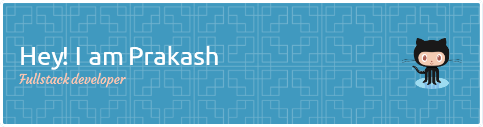

# 💫 About Me:
# Hi, I'm Prakash Singh Basnal 👋

Welcome to my GitHub! I'm a passionate developer with an MCA degree who loves programming and continuously learning new things. Here’s a bit about me:

- 🌱 **Always Learning**: I’m curious about new technologies and strive to improve my skills with every project.
- 🔧 **Tech Stack**: Experienced in Angular, TypeScript, React.js, and Node.js, across both front-end and back-end development.
- 🚀 **Problem Solver**: I enjoy tackling challenges and finding creative solutions.
- 💡 **Tech Enthusiast**: I stay engaged with the latest trends in the tech world and love exploring innovative ways to solve problems.

Let’s connect and make the tech world a better place together!
roblems.  Whether it’s front-end or back-end development,  I’m excited to learn more and take on new challenges.

## 🌐 Socials:
  

# 💻 Tech Stack:
                
# 📊 GitHub Stats:
 
 

### ✍️ Random Dev Quote

<!-- Proudly created with GPRM ( https://gprm.itsvg.in ) --
